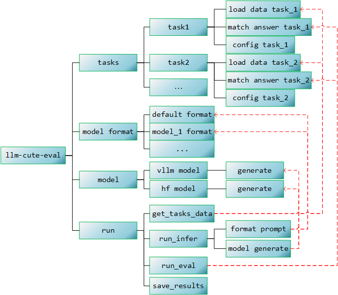

# llm-cute-eval代码说明文档

## 目录

- [模块介绍](#模块介绍)
    - [任务总模块](#任务总模块)
    - [任务模块](#任务模块)
    - [model format模块](#model-format模块)
- [主要数据结构](#主要数据结构)
    - [任务数据结构](#任务数据结构)
    - [推理结果数据结构](#推理结果数据结构)
    - [分数数据结构](#分数数据结构)
- [运行逻辑](#运行逻辑)
- [数据集扩展](#数据集扩展)
- [模型功能扩展](#模型功能扩展)


## 模块介绍



### 任务总模块

包含若干单一任务模块，以及2个脚本文件

```
__init__.py: 包含LOAD_TASK_DATA和MATCH_TASK_ANSWER全局字典变量，LOAD_TASK_DATA是{任务名: 对应加载数据的函数}的映射，MATCH_TASK_ANSWER是{任务名: 对应匹配答案的函数}的映射
match_answer.py: 包含一些常用匹配答案函数
若干名称为{task_name}的文件夹，表示每个任务有一个独立的模块
```

### 任务模块

每个评测任务都有一个独立的文件夹，文件夹名称为任务名称（例如mmlu、gsm8k、commonsenseqa），在文件夹中有3个文件：

```
__init__.py: 空的文件
load_data_{task_name}.py: 读取数据集
包含load_data_{task_name}(args)函数，返回任务数据
match_answer_{task_name}.py: 匹配模型输出答案，返回结果
包含def match_answer_{task_name}(infer_result:dict, round_idx:int, args)函数
```

### model format模块

该模块用于在模型没有实现chat_template时格式化多轮对话，当然一律使用默认格式也是可以的。每种模型类型有一个脚本，用于控制prompt格式和多轮对话格式，默认为default_format（没有格式，保留原始输入）

```
__init__.py: 包含MODEL_FORMAT全局变量字典，该字典是{模型类型: 模型格式化函数}的映射
{model_type}_format.py: {model_type}类型的模型格式，包含format_prompt_{model_type}格式
```

## 主要数据结构

在本框架中，有两个主要数据结构，分别是**任务数据结构**以及**结果数据结构**

### 任务数据结构

读取数据以及推理结果都共享一个数据结构，其结构如下：

```
类型: Dict[str, Dict[str, List[dict]]]
{任务名: {子任务名: [第一条数据, 第二条数据]}}

以下为一个具体的实例
{
	"commonsenseqa": {
		"commonsenseqa": [  ## 若没有子任务，则字典的第二层只包含一个和任务名称相同的子任务名
			第一条数据(dict), 第二条数据(dict), ...
		]
	}
	“mmlu”: {
		“abstract_algebra": [
			第一条数据(dict), 第二条数据(dict), ...
		],
		"anatomy_test": [
			第一条数据(dict), 第二条数据(dict), ...
		],
		...
	}
}
```

评测框架目前仅支持一级子学科，如果有多级子学科，需要全部展开到一级子学科。


单条数据的结构如下，在第一轮推理中，模型实际输入为instruction + fewshot_prompt + prompt_round1：

```
{
	**item: 从数据集中读取的内容，该部分可以灵活调整，主要用于匹配答案,
	"instruction": str,
	"fewshot_prompt": str,
    "prompt_round1": str,
}
```

### 推理结果数据结构

第一轮推理后，任务数据的单条数据中会增加一个infer_round1字段，表示模型输出，如果需要多轮推理，get_multiround_prompt会产生对话提示语，并在结果中进一步加入prompt_round2和infer_round2等：

```
{
	**item: 从数据集中读取的内容，该部分可以灵活调整，主要用于匹配答案,
	"instruction": str,
	"fewshot_prompt": str,
    "prompt_round1": str,
    "infer_round1": str,
}
```

### 分数数据结构

```
类型: Dict[int, Dict[str, dict]]
{round_idx: {task_name: task_result}}

以下为一个具体的实例
{
	"round1": {
        "arc": {
            "arc_e": 0.5,
            "arc_c": 0.3
        },
        "commonsenseqa": {
            "acc": 0.5
        },
        "gsm8k": {
            "exact_match": 0.1,
            "flexible_match": 0.2
        },
    }
	"round2": ...
}
只有一轮时，输出结果summary.json中会直接显示"round1"对应的dict。
```


## 运行逻辑

1、初始化

获取运行参数，确定评测任务和输出目录。

2、读取数据

分别调用不同任务对应的load_data函数。

3、加载模型

使用model.py的模型类初始化模型和采样参数。

4、推理（支持多轮）

将所有数据加载完毕后，对每个任务分别进行批量推理，不同任务可以使用不同的采样参数，将推理结果添加到数据中。

5、匹配答案

将分别调用评测任务的匹配答案函数，传入推理结果，返回对应评测指标。

6、保存结果

将结果整合后，保存到对应文件夹，其中包含每个数据集的每个子任务的细节，以及summary，然后退出程序。


## 数据集扩展

当需要添加一个数据集时，需要根据以下步骤修改程序，假设新增的任务名称为"newtask"

### 1、存放数据集

在data/tasks文件夹中新建newtask文件夹，并放入数据（任意格式均可）

### 2、新建任务模块

```
在lm_cute_eval/tasks文件夹中新建newtask文件夹，并创建四个文件：
__init__.py: 空文件
load_data_newtask.py: 编写加载数据代码，包含load_data_{task_name}(args)函数
match_answer_newtask.py: 编写匹配答案代码，包含def match_answer_{task_name}(infer_result:dict, round_idx:int, args)函数
config_newtask.json: 编写当前任务的配置
```

以上新建的脚本文件可以仿照其他任务，配置文件可以随意添加想要的配置，任务之间互不影响。此外，也可以在该目录中新建其他代码。

### 3、更新任务模块总模块

```
在lm_cute_eval/tasks/__init__.py中新增import内容，并更新LOAD_TASK_DATA和MATCH_TASK_ANSWER字典。可以参考文件中的代码，新增一个任务时，import文件的顺序以级字典中key的顺序应当按字典序升序排序，以便于维护。
```

### 4、更新配置文件

在./lm_cute_eval/utils.py中将newtask加入TASK_LIST。


## 模型功能扩展

若需要扩展模型功能，比如推理行为，可以修改llm-cute-eval/model.py，添加一个新的模型类`MyModel`，并编写`MyModel.generate`函数，在函数中添加推理行为。

```python
class MyModel:
    def __init__(self, args) -> None:
        """初始化模型
        Params:
            args: 运行参数
        Returns:
            None
        """
        pass
    
    def generate(self, prompts, new_sampling_kwargs=None):
        """推理
        Params:
            prompts[List[str]]: 输入的提示词
            new_sampling_kwargs[Dict[str, Any]]: 新的采样参数
        Returns:
            generated_texts[List[str]]: 生成的文本
        """
        pass
```

然后在llm-cute-eval/model.py最下方的initialize_model函数中添加新的模型类，并更新model_type字典。

```python
def initialize_model(args):
    model_type = {
        "hf": HfModel,
        "vllm": VllmModel,
        "my_model": MyModel  # 新增一行
    }
    model = model_type[args.model_type](args)
    return model
```

在编写运行命令时，将运行参数`--model_type`设置为`my_model`，即可使用新的自定义模型。

## 对话格式扩展

在llm-cute-eval/model_format文件夹中，新增文件new_format.py，并编写format函数：

```python
def format_prompt_new(query, history):
    """
    Params:
        query[str]: 当前轮次的输入
        history[List[Tuple[str, str]]]: 历史对话, 格式为[(query, response), (query, response), ...]
    Returns:
        prompt[str]: 格式化后的完整提示词
    """
    pass
```

然后在`llm-cute-eval/model_format/__init__.py`中，将new_format添加到`MODEL_FORMAT`字典中。

```python
from .default_format import format_prompt_default
# ...
from .new_format import format_prompt_new  # add

MODEL_FORMAT = {
    "default": format_prompt_default,
    # ...
    "new_format": format_prompt_new,  # add
}
```


## 多轮对话扩展

在llm-cute-eval/get_multiround_prompt.py中，可以修改多轮对话的格式，添加新的多轮对话。

多轮对话的规则如下：

已知执行完`load_data`函数后，单条数据的结构为：

```python
{
    **item,
    "instruction": str,
    "fewshot_prompt": str,
    "prompt_round1": str
}
```

第一轮推理的输入为（default_format）：

```python
instruction + fewshot_prompt + prompt_round1
```

若第一轮推理结束后，单挑数据的结构会新增`infer_round1`字段，表示第一轮推理的输出。

```python
{
    **item,
    "instruction": str,
    "fewshot_prompt": str,
    "prompt_round1": str,
    "infer_round1": str
}
```

则第二轮的输入为：

```python
instruction + fewshot_prompt + prompt_round1 + "\
n" + infer_round1
```

以此类推，可以添加新的多轮对话。

若需要在多轮对话之间加入特殊token，可以新增model_format模块。

